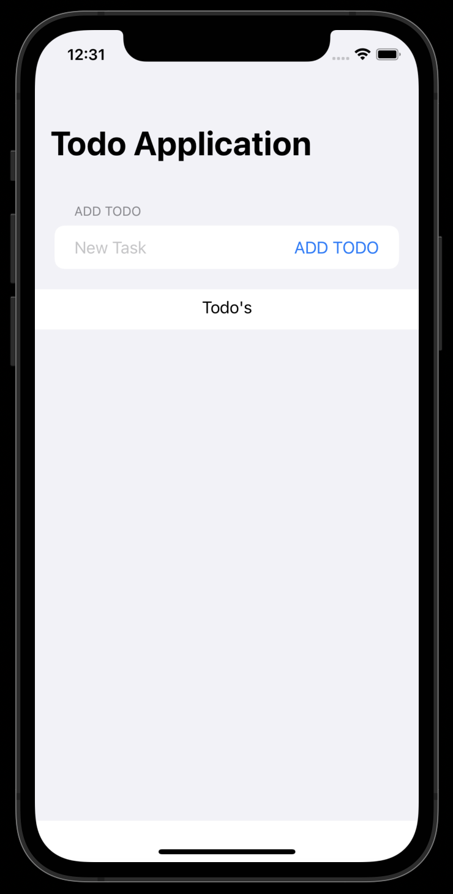
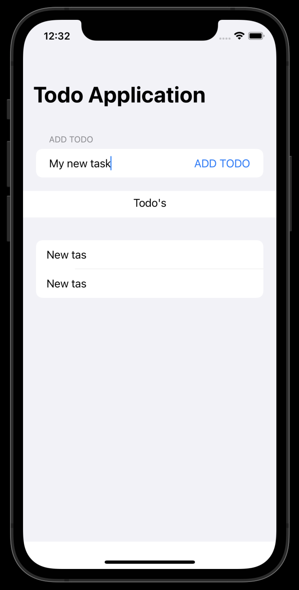

## Todo IOS app

This is a basic Todo API using Django Rest Framework. We can view (get) existing todo items, add (post) new todo item, modify (patch) todo item and remove (delete) todo item.


### 🔗 Content

* [Overview](#todo-ios-app)
* [Content](#-content)
* [Features](#-features)
* [Tech Stack](#-tech-stack)
* [Run Locally](#-run-locally)
* [Documentation](#-documentation)
* [Demo](#-demo)
* [Screen-Shots](#-screen-shots)
* [Author](#-author)


### 📋 Features

- **GET**  --> View All Todos items
- **POST** --> Add new Todo item
- **PATCH** --> Modify Todo item
- **DELETE** --> Delete Todo item


### 🧰 Tech Stack

- **`BACKEND`** : Django *(Python)*

- **`App Logic`** : Swift

- **`App UI`** : Swift UI


### 💻 Run Locally

***Step#1 : Clone Project Repository***

```bash
git clone https://github.com/atharvparkhe/todo-v1-app-ios.git && cd todo-v1-app-ios
```

***Step#2 : Open folder in Xcode***

***Step#3 : Select any iPhone as simulator***

***Step#3 : Press Build Project Button***


### 📄 Documentation

The docs folder contain all the project documentations and screenshots of the project.

**Backend** : https://github.com/atharvparkhe/todo-v1


### 🧑🏻‍💻 Demo

**YouTube Link** : https://youtube.com/shorts/EIl2scMoDsE


### 🌄 Screen-Shots





### 🙋🏻‍♂️ Author

**🤝 Connect with Atharva Parkhe**

[](https://www.linkedin.com/in/atharva-parkhe-3283b2202/)
[](https://www.github.com/atharvparkhe/)
[](https://www.twitter.com/atharvparkhe/)
[](https://www.instagram.com/atharvparkhe/)
[](https://leetcode.com/patharv777/)
[](https://www.youtube.com/channel/UChimOJO64hOqtE7HCgtiIig)
[](https://discord.gg/8WNC43Xsfc)
