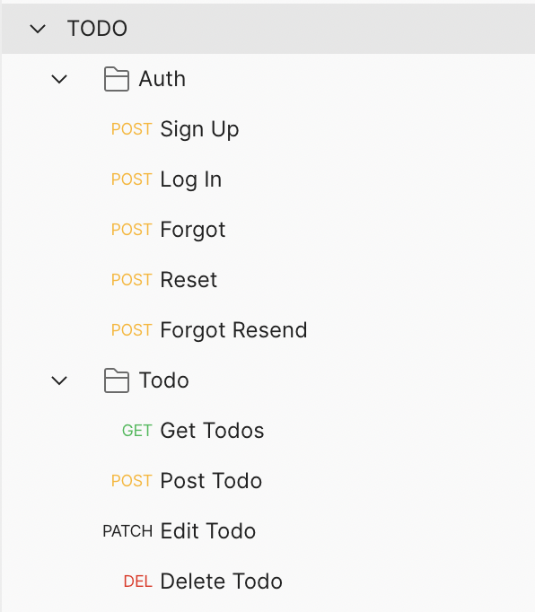
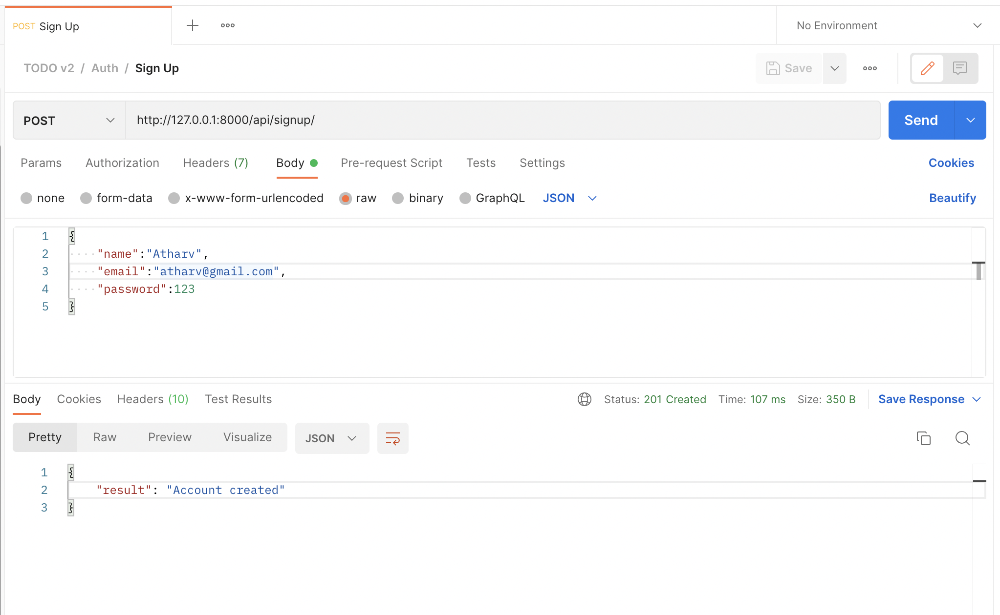
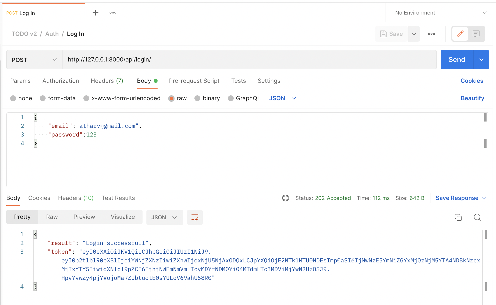
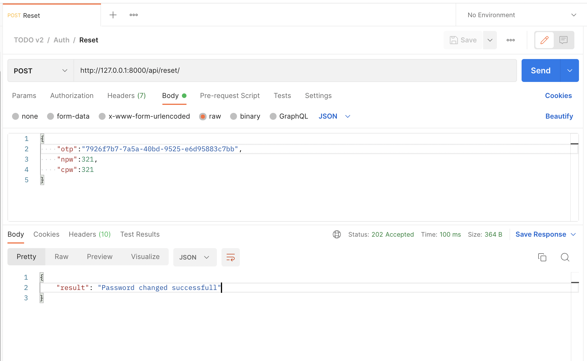
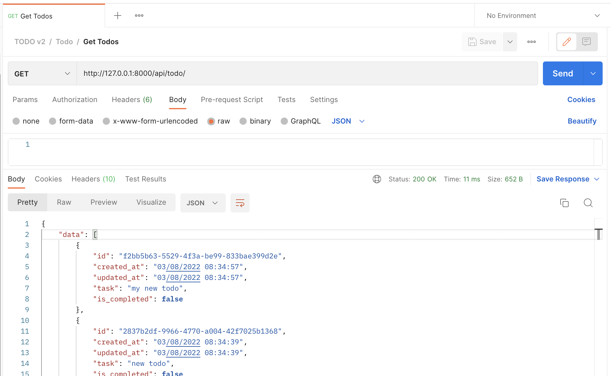
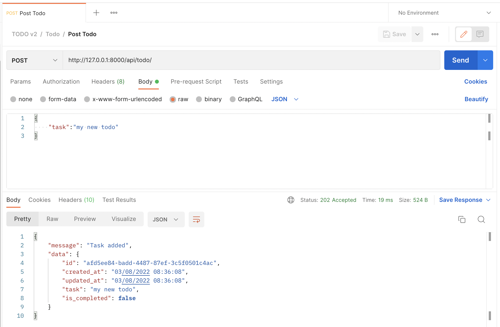
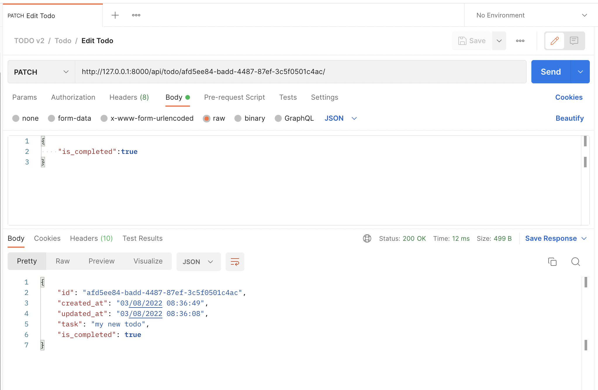

## Todo Application with Authentication

This is a Todo API with Authentication using Django Rest Framework. Users can view (***get***) existing todo items, add (***post***) new todo item, modify (***patch***) todo item and remove (***delete***) todo item, after Authenticating themselves.

**Auth Section** - User can Create an Account (Signup), Log-in into thier Account and Reset thier Account Password.

**Todo Section** - User can View his previously added todo items, create(add) new todo items, modify(edit) existing todo items and delete todo items.

### 🔗 Content

* [Overview](#todo-application)
* [Content](#-content)
* [Features](#-features)
* [Tech Stack](#-tech-stack)
* [API Reference](#-api-reference)
* [Environment Variables](#-environment-variables)
* [Run Locally](#-run-locally)
* [Documentation](#-documentation)
* [Demo](#-demo)
* [Screen-Shots](#-screen-shots)
* [Author](#-author)


### 📋 Features

- **Authentication**
  - **SIGNUP**  --> Create new Account
  - **LOGIN** --> Log-in into thier Account
  - **FORGOT** --> Request Change of Password
  - **RESET** --> Reset thier Account Password

- **Todo**
  - **GET**  --> View All Todos items
  - **POST** --> Add new Todo item
  - **PATCH** --> Modify Todo item
  - **DELETE** --> Delete Todo item


### 🧰 Tech Stack

Django, Django REST Framework *(Python)*


### 🛠 API Reference

**Postman Endpoints** : https://www.getpostman.com/collections/fba7d6a7ef874e693551



**API Endpoints JSON file** (for importing into thunderclient / postman) is available in the docs folder or click [here](docs/endpoints.json)


### 🔐 Environment Variables

To run this project, you will need to add the following environment variables to your **.env** file

- `EMAIL_ID`  -  Email ID (which would be used to send emails)

- `EMAIL_PW`  -  Email Password


### 💻 Run Locally

***Step#1 : Clone Project Repository***

```bash
git clone https://github.com/atharvparkhe/todo-v2.git && cd todo-v2
```

***Step#2 : Create Virtual Environment***

* If *virtualenv* is not installed :
```bash
pip install virtualenv && virtualenv env
```
* **In Windows :**
```bash
env/Scripts/activate
```
* **In Linux or MacOS :**
```bash
source env/bin/activate
```

***Step#3 : Install Dependencies***

```bash
pip install --upgrade pip -r requirements.txt
```

***Step#4 : Add .env file***

- ENV file contents
    - **In Windows :**
    ```bash
        copy .env.example .env
    ```
    - **In Linux or MacOS :**
    ```bash
        cp .env.example .env
    ```
- Enter Your Credentials in the *".env"* file. Refer [Environment Variables](#-environment-variables)

***Step#5 : Run Server***

```bash
python manage.py runserver
```

*Check the terminal if any error.*


### 📄 Documentation

The docs folder contain all the project documentations and screenshots of the project.

**Remote Server Base Link :** https://django-todo-v1.herokuapp.com/

**Local Server Base Link :** http://localhost:8000/

**Admin Pannel :**
- ***Email :*** "admin@admin.com"
- ***Password :*** "password"


### 🧑🏻‍💻 Demo

YouTube Link : https://youtu.be/nrFZw8_5GyE


### 🌄 Screen-Shots

- Authentication





- Todo





### 🙋🏻‍♂️ Author

**🤝 Connect with Atharva Parkhe**

[](https://www.linkedin.com/in/atharva-parkhe-3283b2202/)
[](https://www.github.com/atharvparkhe/)
[](https://www.twitter.com/atharvparkhe/)
[](https://www.instagram.com/atharvparkhe/)
[](https://leetcode.com/patharv777/)
[](https://www.youtube.com/channel/UChimOJO64hOqtE7HCgtiIig)
[](https://discord.gg/8WNC43Xsfc)
